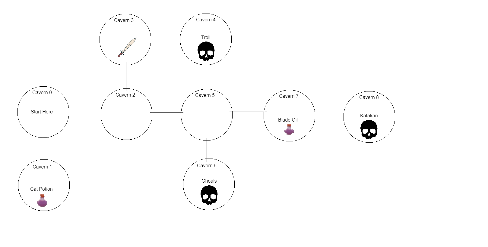
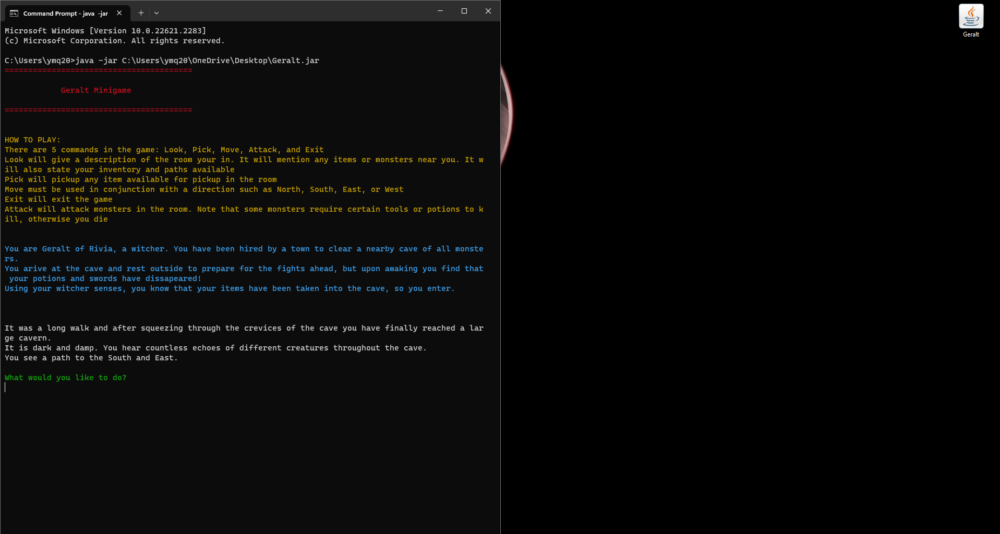
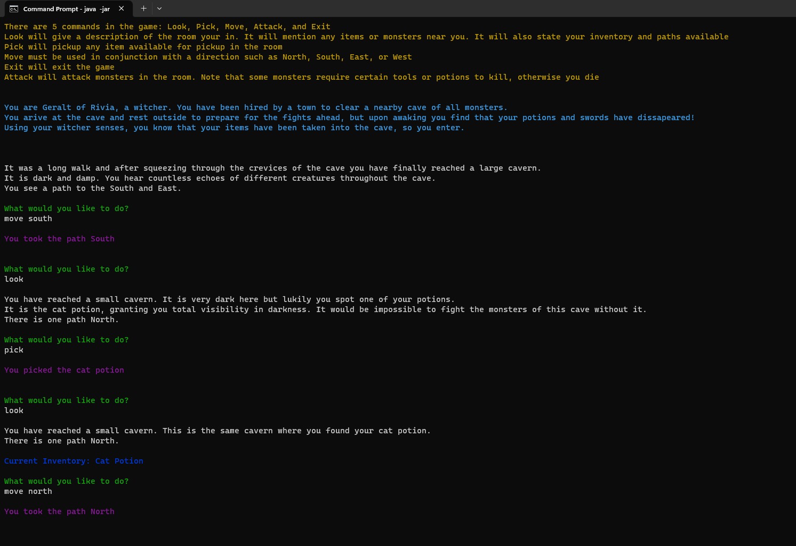

# GeraltofRivia-Minigame

A text based minigame I made as a personal project.
The game was written in java using the eclipse IDE.

## How to Run the Game:
### On windows PC:
Download the Geralt.jar file.
Once this file is downloaded open the command line. This can be done by going in the search and typing terminal.
Once in the command line type the following, "java -jar <Path>. Note that <Path> is the path to the Geralt.jar file, you can either write the path or drag and drop the file into the command line which will print the path automatically.
Then start the game by hitting enter. Note that Java 17 or newer must be installed on the computer to run.

### On MacOS:
Download the Geralt.jar file.
Once this file is downloaded open the terminal. This can be done by going in the search and typing cmd.
Once in the terminal type the following, "java -jar <Path>. Note that <Path> is the path to the Geralt.jar file, you can either write the path or drag and drop the file into the command line which will print the path automatically.
Then start the game by hitting enter. Note that Java 17 or newer must be installed on the computer to run.

*If for any reason you have troble with the above method, download or copy the java files into eclipse or another IDE and run that way.

## Description
The minigame is inspired by the Witcher videogames. In the minigame you play as Geralt of Rivia, and you are tasked with clearing a nearby cave of all monsters. This cave has 9 caverns in total, and the game begins with you in cavern 0. You must traverse the caverns to find your tools and attack the monsters. 
There are 3 monsters in total. The rock troll can be killed with just a sword in your inventory. For defeating the ghouls, you must have the swords and potion in your inventory. To defeat the Katakan, you must have the sword, potion, and vampire blade oil. After defeating all monsters the game ends and you win.

### There are 5 commands:
look: Typing this will print a description of the room you are currently in. It will also print your inventory and any paths you can take.
move: This command must be used with a direction north, south, east, or west (ex. move south). This will move you to the next cavern if there is a path available. Paths can be seen with the look command.
pick: This will pick up any items near you in the room/cavern you are currently in
attack: This will attack any monsters in the room/cavern you are currently in. An attack is succesful if you have the tools required, ortherwise you die and the game ends.
exit: This command will exit the game and return you to the command line or terminal.

